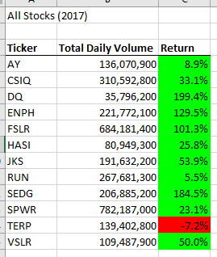
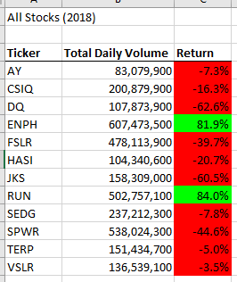
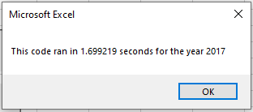
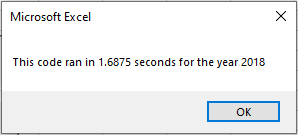
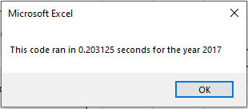
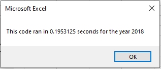
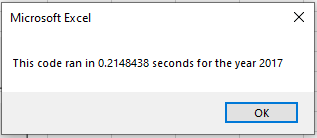
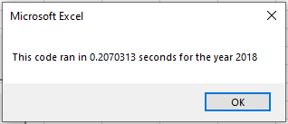

# stock-analysis

## Overview of Project

### The purpose of this analysis is to help in deciding which of a preselected group of stocks to purchase. To do this I looked at how the set of stocks performed over two years, 2017 and 2018. For this analysis I will be looking at the rate of return for each year. Based on this data and how it changed over time I can make some guesses as to what might be the best stock to purchase.

## Results

### Comparing the Data
  Looking at the return data for 2017, we can see that almost all of the stocks in the group showed growth during the year. Only one stock, TERP, showed a loss. Of the stocks that had gains in 2017, 4 of them (DQ, ENPH, FSLR, SEDG) showed a improvment of over 100%, making those 4 look like good options.
  

  The data for 2018 shows a much different picture then the data for 2017. All but two stocks, ENPH and RUN, showed a loss. The two stocks that showed growth both had more then 80% return. This makes them the best bet for purchase. When choosing between the two it should be noted that while both stocks showed positive returns each year, only RUN actually improved more in 2018 then 2017. 
  

### Comparing the Code
  To create the summarized view of data that supproted the above analysis we used VBA code. Two versions of that VBA code were tested and compared to decide which would run better in the final worksheet. The first version averaged around 1.69 seconds for each year
  

  The second version of the code ran much quicker. This refactored version averaged around 0.2 seconds. That huge difference shows that the refactored code is far more efficiant the the original version  
  

## Summary

  Refactoring code has many advantages. It can speed up the time it takes it takes for the code to execute. It can make the code more readable to someone who is is not the author. It can eliminate redundancy in code and when changes and updates need to be made, it can make it so that change or update only needs to be made in one place instead of multiple subroutines. Eliminating lines of code as in the previous example can also make the final filesize of the code file smaller. It can also fix areas that could cause an error when run certain ways. The only disadvantage I can think of in refactoring code is the time it takes to analyze the existing code and come up with ways to improve it. 

  In refactoring the code used for this analysis we made use of several of the advantages refactoring offers. The refactored code ran in nearly 10% of the time the original code took, a huge speed boost. This speed boost was achieved by eliminating redundancy in the code. The original version of the code looped through the entire set of data multiple times, once for each ticker. By changing the variables to arrays we were able to loop through the data only once. I actually took it step further and created an additional subroutine called "AllStocksAnalysisRefactoredMore()". I changed the way some variables were declared to save some space. In my version the arrays aren't created with a loop they are declared in their final versions saving some space. Then I added a check to make sure the user had entered a valid year, in the original refactored code an error appeared if a value other then 2017 or 2018 were entered. Finally I moved all the value setting and formatting for the final sheet to the end. It didn't make sense to me to add values to the sheet, go to the other sheet to get data, then come back and add more values to the first sheet. My code ran in nearly the same amount of time as the refactored code. As far as disadvantages it only took me a few minutes to make the changes I did so feel the time was worth it.

